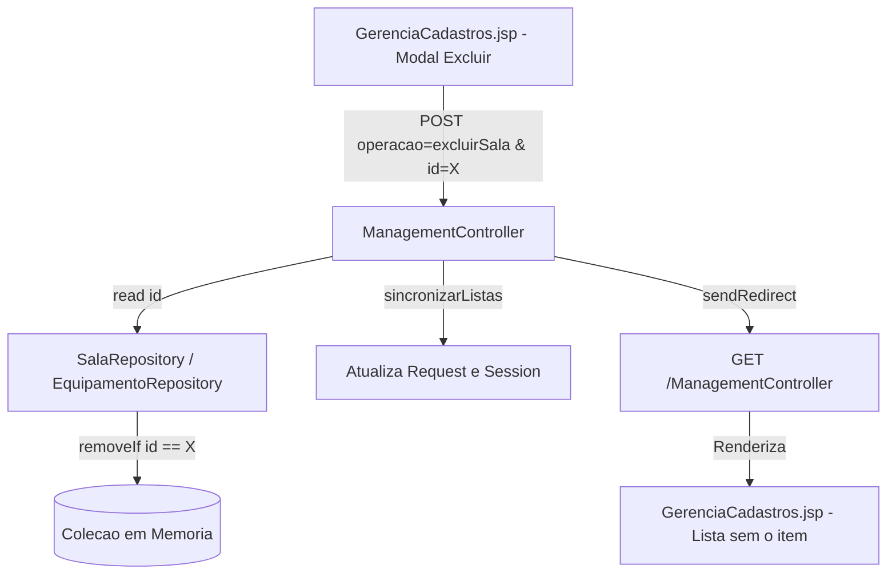

# Requirements

### Overview & Goals
Garantir a máxima eficácia e confiabilidade na gestão de recursos (Salas e Equipamentos) no sistema `ReserveSala`. O objetivo é eliminar a inconsistência de estado em que o sistema emite um feedback positivo de exclusão enquanto o registro permanece ativo em memória e visível na interface do usuário. A meta de utilidade do sistema é assegurar sincronismo total entre as intenções do usuário, a persistência nos repositórios e o estado renderizado nas visualizações.

### Scope
- **In Scope:**
  - Correção da lógica de exclusão nos repositórios em memória (`SalaRepository`, `EquipamentoRepository`, `AulaRepository`, `ProfessorRepository`).
  - Implementação de igualdade canônica (`equals` e `hashCode`) nas entidades (`Sala`, `Equipamento`, `Aula`, `Professor`) com base no identificador único.
  - Validação do fluxo de exclusão em `ManagementController` e garantia de atualização imediata das listas no escopo de requisição e sessão.
  - Verificação da resposta visual e remoção da linha na tabela de `GerenciaCadastros.jsp`.
- **Out of Scope:**
  - Migração da camada de persistência para banco de dados relacional (permanecerá em coleções em memória).
  - Redesenho visual ou alteração de estilização CSS da tela `GerenciaCadastros.jsp`.

### User Stories
- **Como** professor/administrador docente autenticado,
- **Quero** confirmar a exclusão de uma sala ou equipamento indesejado através do modal de confirmação,
- **Para que** o item seja imediatamente e definitivamente expurgado do sistema, liberando capacidade de gerenciamento sem falsos positivos.

### Functional Requirements
- **FR-01:** Ao submeter o formulário de exclusão de sala com `operacao="excluirSala"` e um `id` válido, o `SalaRepository` deve remover o registro da lista interna `salas`.
- **FR-02:** Ao submeter o formulário de exclusão de equipamento com `operacao="excluirEquipamento"` e um `id` válido, o `EquipamentoRepository` deve remover o registro da lista interna `equipamentos`.
- **FR-03:** A lista de salas e equipamentos mantida em `request` e `session` através de `sincronizarListas()` e da custom tag `<natborges:carregaTudo/>` deve conter apenas os registros remanescentes.
- **FR-04:** Após o redirecionamento para `GerenciaCadastros.jsp`, a mensagem de sucesso deve ser exibida e a tabela correspondente não deve mais conter o item excluído.

### Non-Functional Requirements
- **NFR-01 (Consistência e Integridade de Dados):** Operações de mutação em memória devem ter efeito imediato e determinístico em tempo $O(N)$ sem vazamento de referências obsoletas.
- **NFR-02 (Confiabilidade do Feedback):** O sistema nunca deve emitir mensagens de sucesso quando uma mutação de estado falhar silenciosamente.

# Technical Design

### Current Implementation
A arquitetura do sistema utiliza repositórios estáticos em memória com listas `List<T>`.
1. **Padrão de Consulta e Replicação:** Os métodos `read(id)` dos repositórios (`SalaRepository.java`, `EquipamentoRepository.java`, `AulaRepository.java`, `ProfessorRepository.java`) utilizam o padrão `selfReplicate()` para evitar efeitos colaterais por referência compartilhada, devolvendo um novo objeto instanciado.
2. **Falha na Exclusão:**
   - No `ManagementController.java`:
     ```java
     Sala s = SalaRepository.read(id); // Retorna uma nova instância clonada via selfReplicate()
     SalaRepository.delete(s);
     ```
   - No `SalaRepository.java` e `EquipamentoRepository.java`:
     ```java
     public static void delete (Sala room){
         salas.remove(room); // Invoca List.remove(Object)
     }
     ```
   - Como as classes `Sala` e `Equipamento` **não sobrescrevem `equals(Object)` nem `hashCode()`**, a chamada `List.remove(room)` recorre à comparação padrão de `Object.equals`, que testa a identidade de referência (`this == o`).
   - Como `room` é um clone recente retornado por `selfReplicate()`, ele nunca é estritamente idêntico a nenhum elemento contido na lista interna. Portanto, `salas.remove(room)` falha silenciosamente (retorna `false`), mantendo o registro intacto no repositório enquanto a controller segue o fluxo e emite `msg = "Sala excluída com sucesso!"`.

### Key Decisions
1. **Remoção Baseada em Predicado / ID nos Repositórios:**
   - *Decisão:* Adotar `removeIf(item -> item.getId() == targetId)` nos repositórios e prover sobrecarga `delete(int id)` e `delete(T entity)`.
   - *Racional:* Torna a operação imune a inconsistências de referência de memória e desacopla a deleção da necessidade de pré-instanciação de objetos.
2. **Sobrescrita Canônica de `equals` e `hashCode` nas Entidades:**
   - *Decisão:* Implementar `equals` e `hashCode` baseados no identificador primário (`id` / `siape`) em `Sala`, `Equipamento`, `Aula` e `Professor`.
   - *Racional:* Garante coerência semântica e interoperabilidade com coleções Java (`Set`, `List.contains`, `List.remove`), maximizando a robustez do domínio.

### Proposed Changes
- **`com.ifpe.reservesala.model.repository.SalaRepository`:**
  - Refatorar `delete(Sala room)` para `salas.removeIf(s -> s.getId() == room.getId())` e/ou adicionar `public static void delete(int id)`.
- **`com.ifpe.reservesala.model.repository.EquipamentoRepository`:**
  - Refatorar `delete(Equipamento equip)` para `equipamentos.removeIf(e -> e.getId() == equip.getId())` e/ou adicionar `public static void delete(int id)`.
- **`com.ifpe.reservesala.model.repository.AulaRepository` & `ProfessorRepository`:**
  - Padronizar o método `delete` para garantir que exclusões futuras não sofram da mesma limitação de clonagem.
- **`com.ifpe.reservesala.model.entities.Sala` / `Equipamento`:**
  - Adicionar implementações de `equals` e `hashCode` utilizando o campo `id`.

### Data Models / Contracts

```java
// Em Sala.java:
@Override
public boolean equals(Object o) {
    if (this == o) return true;
    if (o == null || getClass() != o.getClass()) return false;
    Sala sala = (Sala) o;
    return id == sala.id;
}

@Override
public int hashCode() {
    return Integer.hashCode(id);
}
```

```java
// Em SalaRepository.java:
public static void delete(Sala room) {
    if (room != null) {
        salas.removeIf(s -> s.getId() == room.getId());
    }
}

public static void delete(int id) {
    salas.removeIf(s -> s.getId() == id);
}
```

### Architecture Diagram



### Risks & Mitigations
- **Risco:** Falha de sincronização se a custom tag `<natborges:carregaTudo/>` rodar antes ou sobrescrever os atributos.
  - *Mitigação:* `CarregarIndex.java` lê diretamente de `SalaRepository.readAll()`. Como a alteração no repositório é direta na lista em memória compartilhada, qualquer subsequente `readAll()` refletirá com 100% de precisão a ausência do elemento.

# Testing

### Validation Approach
A verificação visa garantir a eliminação de qualquer falso positivo no ciclo de vida dos recursos, assegurando que o feedback do sistema reflita fielmente o estado da aplicação.

### Key Scenarios
1. **Exclusão de Sala Existente:**
   - **Ação:** No `GerenciaCadastros.jsp`, acionar o modal de exclusão para uma sala existente (ex.: `#1 F42-101`) e submeter a confirmação.
   - **Resultado Esperado:** A sala é removida de `SalaRepository.salas`, a mensagem de sucesso é apresentada no topo e a linha `#1` não consta mais na tabela.
2. **Exclusão de Equipamento Existente:**
   - **Ação:** Acionar o modal de exclusão para um equipamento existente (ex.: `#1 Projetor Epson`) e submeter a confirmação.
   - **Resultado Esperado:** O equipamento é removido de `EquipamentoRepository.equipamentos` e a tabela é re-renderizada sem o respectivo registro.
3. **Persistência Volátil e Consulta Posterior:**
   - **Ação:** Após a exclusão, navegar para a tela de Aulas (`indexProfessor.jsp`) e abrir o modal de cadastro de aula.
   - **Resultado Esperado:** O item excluído não deve figurar entre as opções de salas/equipamentos disponíveis para reserva.
4. **Tentativa de Exclusão com Identificador Inexistente:**
   - **Ação:** Submeter requisição com `id` não existente.
   - **Resultado Esperado:** O repositório não altera os itens existentes e nenhuma exceção não tratada é gerada.

# Delivery Steps

### ✓ Step 1: Implementar remoção consistente e igualdade por identificador nos Repositórios e Entidades
Garante que a remoção de entidades seja executada com precisão no armazenamento em memória eliminando falhas por comparação de referência.

- Atualizar o método `delete` em `SalaRepository.java` para utilizar remoção explícita por identificador (ex.: `salas.removeIf(s -> s.getId() == room.getId())` ou sobrecarga direta `delete(int id)`).
- Atualizar o método `delete` em `EquipamentoRepository.java` para utilizar remoção explícita por identificador (ex.: `equipamentos.removeIf(e -> e.getId() == equip.getId())`).
- Atualizar o método `delete` em `AulaRepository.java` e `ProfessorRepository.java` seguindo o mesmo padrão defensivo baseado em chaves (`id` e `siape`), prevenindo inconsistências semelhantes no restante do sistema.
- Implementar os métodos `equals(Object o)` e `hashCode()` baseados no identificador único (`id` / `siape`) nas classes de entidade `Sala.java`, `Equipamento.java`, `Aula.java` e `Professor.java`.

### ✓ Step 2: Validar integração com o ManagementController e sincronização visual em GerenciaCadastros
Assegura que o fluxo completo de requisição, exclusão no repositório, sincronização de sessão/request e atualização da tabela reflita imediatamente o novo estado.

- Verificar os métodos `excluirSala` e `excluirEquipamento` em `ManagementController.java`, garantindo tratamento robusto de erros e integridade na sincronização de atributos (`sincronizarListas`).
- Validar a captura de eventos no modal de confirmação `#modalExcluir` em `GerenciaCadastros.jsp` garantindo que os parâmetros `operacao` e `id` corretos cheguem ao servlet.
- Garantir que a renderização da tabela no `GerenciaCadastros.jsp` reflita a ausência do registro excluído e exiba o estado vazio ("Nenhuma sala/equipamento cadastrado") caso o último item seja removido.